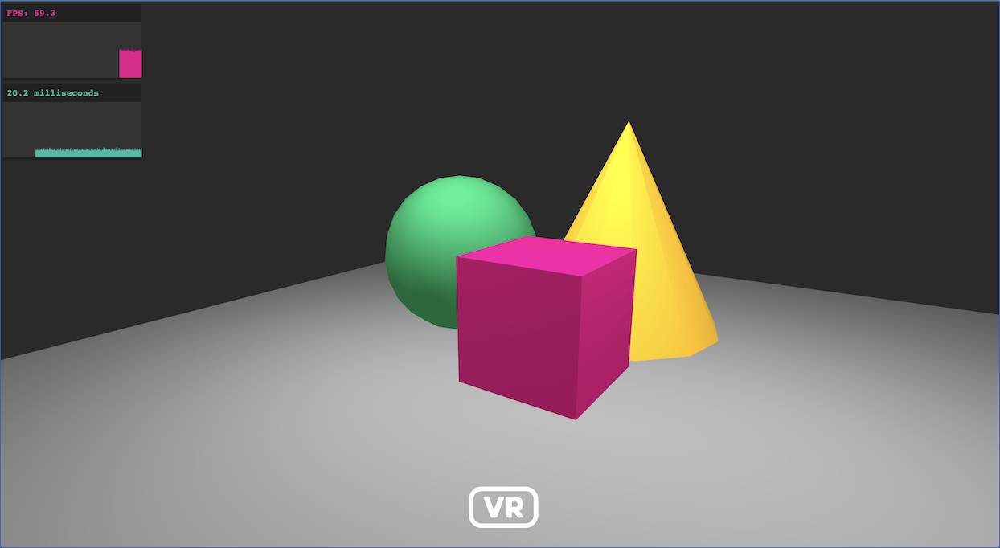

# Wonderland Engine Stats

WonderlandEngine stats component.



This library is inspired by [stats.js](https://github.com/mrdoob/stats.js) from mrdoob.

## Features

@todo

## Usage

You can install the library using `yarn` / `npm`:


```sh
yarn i wle-stats
```

### Wonderland Component

No further setup is required, you can search the component and add it to any object.

For more information, you can open the Wonderland Engine example located
in [Wonderland Engine example](./example).

### Manually

This library exposes a [StatsGraph class](./src/stats.ts) class you can use.

```js
import {StatsGraph} from 'wle-stats';

const stats = new StatsGraph({
    minY: 0,
    maxY: 120,
    width: 100,
    height: 40
});
```

You can add the graph canvas anywhere in the dom using:

```js
document.body.append(stats.canvas);
```

Adding a value is done using `update(value)`:

```js
// Draws '50.0' on the chart.
stats.update(50.0);
```

For more information, please have a look at the public interface of the
[StatsGraph](./src/stats.ts) class.

## Future

WonderlandEngine doesn't expose (yet) its profiler. In the future, this library will take advatange of the internal profiler to display fine-grained numbers.
